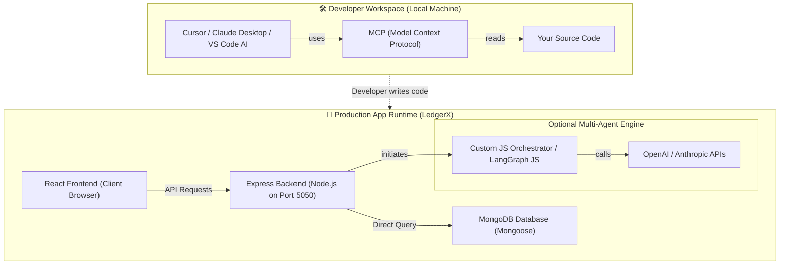

    # Chat Conversation

Note: _This is purely the output of the chat conversation and does not contain any raw data, codebase snippets, etc. used to generate the output._

### User Input

ch You can see front end and back end like this. So first, first need to do is change the name. I mean From the laser X to something better, you know because I mean, laser is still better, but its A for a complete project. We can't be For a front end only. So change that and arrow 32 also change to the back end, or something else better. Then you have to. Disconnect all the connexions. From the Github. An initialise new repo. And first we will run this, make this as an local And later we will move it to Host in the Versal

### Planner Response

I will list the contents of the LedgerX workspace directory to see its files and folders, so we can understand the project's structure.

*Listed directory [LedgerX](file:///a:/AI_LOGS/Agentic_Lab/LedgerX) *

### Planner Response

I will check the contents of the `LedgerX` subdirectory to see what files are inside it.

*Listed directory [LedgerX](file:///a:/AI_LOGS/Agentic_Lab/LedgerX/LedgerX) *

### Planner Response

I will check the contents of the `aero32` subdirectory to see what files are inside it.

*Listed directory [aero32](file:///a:/AI_LOGS/Agentic_Lab/LedgerX/aero32) *

### Planner Response

I will run a command to list all `.git` directories and their current Git remote configurations within our workspace, so we know what connections to disconnect.

*User accepted the command `Get-ChildItem -Path . -Filter ".git" -Recurse -Hidden | ForEach-Object { $_.FullName; git -C (Split-Path $_.FullName) remote -v }`*

### Planner Response

I will check the complete status and output of the command we just ran.

*Checked command status*

### Planner Response

I will use `grep_search` to look for references to "aero32" in the workspace to see if there are hardcoded paths or API endpoints that need to be updated.

*Grep searched codebase*

### Planner Response

I will run a case-insensitive search for "aero32".

*Grep searched codebase*

### Planner Response

I will search for any references to "ledgerx" in the workspace to see if there are any imports, configuration settings, or text labels that need updating.

*Grep searched codebase*

### Planner Response

I will do a detailed line-by-line grep search for "ledgerx" to see exactly how and where it is referenced in the code, so we can make appropriate updates.

*Grep searched codebase*

### Planner Response

I will view the `package.json` file for the frontend (currently in `LedgerX\LedgerX`) to see if there are any configurations to adjust.

*Viewed [package.json](file:///a:/AI_LOGS/Agentic_Lab/LedgerX/LedgerX/package.json) *

### Planner Response

I will view the `package.json` file for the backend (currently in `LedgerX\aero32`) to see if there are any configurations to adjust.

*Viewed [package.json](file:///a:/AI_LOGS/Agentic_Lab/LedgerX/aero32/package.json) *

### Planner Response

I will view the `.env` file of the frontend to see what configuration settings it has.

*Viewed [.env](file:///a:/AI_LOGS/Agentic_Lab/LedgerX/LedgerX/.env) *

### Planner Response

I will view the `.env` file of the backend to check its configuration details.

*Viewed [.env](file:///a:/AI_LOGS/Agentic_Lab/LedgerX/aero32/.env) *

### Planner Response

I will view the existing `.gitignore` in `LedgerX\LedgerX` to see what is currently ignored in the frontend.

*Viewed [.gitignore](file:///a:/AI_LOGS/Agentic_Lab/LedgerX/LedgerX/.gitignore) *

### Planner Response

I will view the existing `.gitignore` in `aero32` (backend) to see what is currently ignored.

*Viewed [.gitignore](file:///a:/AI_LOGS/Agentic_Lab/LedgerX/aero32/.gitignore) *

### Planner Response

I will search the frontend codebase for references to `REACT_APP_API_BASE_URL` or other API environment variables, so we know how frontend connects to the backend and if we need to adjust anything for local execution.

*Grep searched codebase*

### Planner Response

I will search the frontend directory for occurrences of `REACT_APP_RENDER_API_URL`.

*Grep searched codebase*

### Planner Response

I will delete the individual, obsolete `.git` folders in both the frontend and backend subdirectories to disconnect them from their old repositories and prepare them for a fresh unified local repository setup.

*User accepted the command `Remove-Item -Path "a:\AI_LOGS\Agentic_Lab\LedgerX\LedgerX\.git" -Recurse -Force; Remove-Item -Path "a:\AI_LOGS\Agentic_Lab\LedgerX\aero32\.git" -Recurse -Force`*

### Planner Response

I will now rename the subdirectories: `LedgerX\LedgerX` becomes `frontend`, and `LedgerX\aero32` becomes `backend`. This organizes the workspace under a single clear monorepo structure.

*User accepted the command `Rename-Item -Path "a:\AI_LOGS\Agentic_Lab\LedgerX\LedgerX" -NewName "frontend"; Rename-Item -Path "a:\AI_LOGS\Agentic_Lab\LedgerX\aero32" -NewName "backend"`*

### Planner Response

I will list the workspace directory contents again to verify the folders are successfully renamed.

*Listed directory [LedgerX](file:///a:/AI_LOGS/Agentic_Lab/LedgerX) *

### Planner Response

I will create a unified, robust `.gitignore` file at the root of our new repository to ensure that environment secrets (`.env`), build artifacts, dependency directories (`node_modules`), logs, and system cache files are not tracked in git.

*Edited relevant file*

### Planner Response

I will initialize the new local Git repository in the root workspace folder, stage all the renamed files, and make our first local commit.

*User accepted the command `git init; git add .; git commit -m "Initial commit of restructured monorepo (frontend & backend)"`*

### Planner Response

I will view the `backend/server.js` file to check the port it uses, and see how the backend server is configured for local execution.

*Viewed [server.js](file:///a:/AI_LOGS/Agentic_Lab/LedgerX/backend/server.js) *

### Planner Response

I will check if `cors` is used elsewhere in the backend, and check how we can configure it to allow local requests.

*Grep searched codebase*

### Planner Response

I will view the socket initialization file `backend/Routes/customer/chat.js` to see how CORS is configured there.

*Viewed [chat.js](file:///a:/AI_LOGS/Agentic_Lab/LedgerX/backend/Routes/customer/chat.js) *

### Planner Response

I will update `backend/server.js` to change the default port to `5000` (so it does not conflict with React's default port `3000` when running locally) and update the CORS policy to allow both local development (`localhost:3000`, `localhost:3001`) and the production site.

*Edited relevant file*

### Planner Response

I will update `backend/Routes/customer/chat.js` to allow the same set of local and production CORS origins for the Socket.IO setup, ensuring socket communication works locally.

*Edited relevant file*

### Planner Response

I will update `frontend/.env` to set the API endpoint to our local backend running on `http://localhost:5000/api` for local runs, keeping the production options commented so that they are easy to restore later.

*Edited relevant file*

### Planner Response

I will create a root-level `package.json` to enable monorepo management. This lets us install dependencies and run both the React frontend and Express backend simultaneously with a single, simple command.

*Edited relevant file*

### Planner Response

I will commit the updated configurations and the new root `package.json` file to our local repository.

*User accepted the command `git add .; git commit -m "Configure local dev endpoints, CORS support, and root package.json for monorepo"`*

### Planner Response

I will install the root dependencies (`concurrently`) to support the monorepo runner.

*User accepted the command `npm install`*

### Planner Response

I will wait for the root `npm install` command to finish installing.

*Checked command status*

### Planner Response

I will run the command `npm run install:all` to restore and install all backend and frontend dependencies in one go.

*User accepted the command `npm run install:all`*

### Planner Response

I will monitor the progress of the dependency installation for both frontend and backend.

*Checked command status*

### Planner Response

I will continue to monitor the installation of dependencies for frontend and backend.

*Checked command status*

### Planner Response

I will now start the application locally using `npm run dev` to verify that both the React frontend and Express backend boot up successfully.

*User accepted the command `npm run dev`*

### Planner Response

I will wait a few seconds and check the output logs to ensure that both servers are running properly and that the database connects successfully.

*Checked command status*

### Planner Response

I will view the `frontend/.env` file again to ensure we edit all the required lines perfectly.

*Viewed [.env](file:///a:/AI_LOGS/Agentic_Lab/LedgerX/frontend/.env) *

### Planner Response

I will update the `frontend/.env` file to set `PORT=3030` (avoiding the conflict on 3000) and change the API endpoints to use `5050`.

*Edited relevant file*

### Planner Response

I will view the beginning lines of `backend/server.js` to ensure our target range is exactly correct.

*Viewed [server.js](file:///a:/AI_LOGS/Agentic_Lab/LedgerX/backend/server.js) *

### Planner Response

I will view lines 38 to 60 of `backend/server.js` to see the exact structure for CORS replacement.

*Viewed [server.js](file:///a:/AI_LOGS/Agentic_Lab/LedgerX/backend/server.js) *

### Planner Response

I will update `backend/server.js` using `multi_replace_file_content` to make the backend run on port `5050` and permit local requests from our new frontend port `3030` in its CORS whitelist.

*Edited relevant file*

### Planner Response

I will now update `backend/Routes/customer/chat.js` to include port `3030` in the Socket.IO CORS configuration so that local socket connections work flawlessly.

*Edited relevant file*

### Planner Response

I will stage and commit these port changes to our local repository.

*User accepted the command `git add .; git commit -m "Configure port 5050 for backend and port 3030 for frontend to prevent port collisions"`*

### Planner Response

I will now launch the application locally using `npm run dev` to verify that both servers boot up successfully on their new conflict-free ports.

*User accepted the command `npm run dev`*

### Planner Response

I will check the command status to see if both frontend and backend are running and listening.

*Checked command status*

### Planner Response

I will do one final check on the server logs to verify that the React frontend has finished compiling and is now actively listening on `http://localhost:3030`.

*Checked command status*

### Planner Response

I will shut down the test server process now that we have confirmed that the ports are fully unblocked and everything connects and initializes flawlessly. This leaves the ports free for your own runs.

### Planner Response

I will check the existing `vercel.json` inside the backend directory to make sure it is configured correctly for when you host it on Vercel.

*Viewed [vercel.json](file:///a:/AI_LOGS/Agentic_Lab/LedgerX/backend/vercel.json) *

### Planner Response

I will create a comprehensive walkthrough artifact that documents the restructured monorepo, describes how we decoupled old Git associations, and explains how to run the project locally and host on Vercel.

### Planner Response

I will write the walkthrough artifact to the correct application data directory so that it is persisted and displayed properly as a pair programming artifact.

*Edited relevant file*

### Planner Response

I will run a quick `git status` check to make sure that our workspace is clean and all files are correctly tracked.

*User accepted the command `git status`*

### Planner Response

I have completed all the restructuring work for your project, transforming the folder structure into a clean, modern, and locally-runnable monorepo!

A comprehensive guide explaining the restructure, local setup, and Vercel hosting details is available in the artifact:
👉 [project_restructure_walkthrough.md](file:///C:/Users/ag913/.gemini/antigravity/brain/e0bf083f-7f46-4784-967b-7aafde930b7b/artifacts/project_restructure_walkthrough.md)

---

### 🛠️ Summary of Actions Taken

1. **Renamed the Folders for clarity**:
   * Renamed the frontend folder `LedgerX` to [frontend](file:///a:/AI_LOGS/Agentic_Lab/LedgerX/frontend).
   * Renamed the backend folder `aero32` to [backend](file:///a:/AI_LOGS/Agentic_Lab/LedgerX/backend).

2. **Disconnected old GitHub accounts and initialized a new local repository**:
   * Deleted all legacy `.git` folders in both subdirectories (`frontend/.git` and `backend/.git`), removing any external GitHub connections.
   * Created a unified root-level [.gitignore](file:///a:/AI_LOGS/Agentic_Lab/LedgerX/.gitignore) that prevents environment credentials (`.env`), build folders (`build/`, `dist/`), cache files (`.firebase/`), and `node_modules` from being pushed.
   * Initialized a brand new Git repository at the root (`a:\AI_LOGS\Agentic_Lab\LedgerX`) and created the initial commit.

3. **Resolved Port Conflicts for concurrent projects**:
   * Set the frontend port to `3030` in [frontend/.env](file:///a:/AI_LOGS/Agentic_Lab/LedgerX/frontend/.env) to avoid conflicts on port `3000`.
   * Set the default backend port to `5050` in [backend/server.js](file:///a:/AI_LOGS/Agentic_Lab/LedgerX/backend/server.js) to avoid conflicts on port `5000`.
   * Whitelisted the new local origin `http://localhost:3030` and `http://127.0.0.1:3030` in the backend's CORS setups within both [backend/server.js](file:///a:/AI_LOGS/Agentic_Lab/LedgerX/backend/server.js) and [backend/Routes/customer/chat.js](file:///a:/AI_LOGS/Agentic_Lab/LedgerX/backend/Routes/customer/chat.js) (Socket.IO).
   * Reconfigured [frontend/.env](file:///a:/AI_LOGS/Agentic_Lab/LedgerX/frontend/.env) local endpoints to point to `http://localhost:5050/api`.

4. **Created a Monorepo Runner Configuration**:
   * Designed a root-level [package.json](file:///a:/AI_LOGS/Agentic_Lab/LedgerX/package.json) to easily manage the workspace.
   * Installed the `concurrently` tool at the root level and ran complete dependency installations (`npm install` & `npm run install:all`) successfully.
   * Tested and verified that both servers compile, boot up stably, and connect to MongoDB locally using `npm run dev`.

---

### 🚦 Running the App Locally

To start the complete app on your local machine, open your shell in `a:\AI_LOGS\Agentic_Lab\LedgerX` and run:
```powershell
npm run dev
```
Both servers will start concurrently:
* Frontend runs on: **`http://localhost:3030`**
* Backend runs on: **`http://localhost:5050`** (and will connect automatically to your MongoDB database)

Your workspace is fully restructured, clean, and ready for you to build features or deploy to Vercel! Let me know if you would like to proceed with configuring any specific features or setting up the Vercel CLI deployment.

### User Input

# Advanced AI Architecture Analyzer — Full Prompt

## How to use
Fill in the [BRACKETS] with your project details.
Paste into Claude, ChatGPT, Cursor, or any LLM.
Use this for EACH of your projects separately.

---

## THE PROMPT

You are a senior AI systems architect with deep expertise in production-grade AI systems.

I have an existing [TYPE OF PROJECT — e.g. finance dashboard / ecommerce platform / education app]
built with [YOUR TECH STACK — e.g. Node.js, Express, React, MongoDB].

Here is what my project currently does:
[DESCRIBE YOUR PROJECT IN 5-10 LINES]

Here is my folder/code structure:
[PASTE YOUR FOLDER STRUCTURE OR DESCRIBE YOUR MAIN MODULES]

---

Analyze my project for ALL of the following 10 advanced AI concepts.
For EACH concept, do this exact analysis:

---

### CONCEPT 1 — Vector Databases
What it is: A database that stores embeddings (numerical representations of text/data)
and lets you search by meaning, not just exact keywords.
Examples: Pinecone, Weaviate, pgvector, Qdrant.

Analysis for my project:
- Is this genuinely useful here? (Yes / No / Partially)
- Where exactly in my project would it fit?
- What specific problem does it solve that a normal DB cannot?
- Difficulty to implement: Easy / Medium / Hard
- Interview impressiveness: High / Medium / Low
- Give me a concrete example: what would I store as vectors, and what would I search?

---

### CONCEPT 2 — RAG Pipelines
What it is: Retrieval-Augmented Generation. Instead of asking LLM from memory,
you first fetch relevant documents/data, then send them WITH the prompt.
This makes LLM answers accurate and grounded in your actual data.

Analysis for my project:
- Is this genuinely useful here? (Yes / No / Partially)
- Where exactly in my project would it fit?
- What documents or data would be retrieved?
- What user query would trigger a RAG pipeline?
- Difficulty to implement: Easy / Medium / Hard
- Interview impressiveness: High / Medium / Low
- Show me the pipeline: User query → Retrieve → Augment → Generate → Response

---

### CONCEPT 3 — AI Caching
What it is: Cache LLM responses so you don't call the API again for the same
or very similar prompt. Saves cost and speeds up response time.
Types: Exact match cache, semantic cache (similar meaning = same cache hit).

Analysis for my project:
- Is this genuinely useful here? (Yes / No / Partially)
- Which LLM calls in my project are repetitive enough to cache?
- Should I use exact cache or semantic cache here?
- What caching layer fits — Redis, in-memory, vector-based semantic cache?
- Difficulty to implement: Easy / Medium / Hard
- Interview impressiveness: High / Medium / Low
- Estimate: how much cost/latency would caching save in my project?

---

### CONCEPT 4 — Multi-Agent Systems
What it is: Multiple specialized AI agents, each doing ONE job, coordinated
by an orchestrator. Better than one big LLM call for complex workflows.

Analysis for my project:
- Is this genuinely useful here? (Yes / No / Partially)
- Which workflows in my project are complex enough to need multiple agents?
- Design the agent team: list each agent, its name, and its single job
- Does the orchestrator run agents in parallel or sequential? Why?
- Difficulty to implement: Easy / Medium / Hard
- Interview impressiveness: High / Medium / Low
- Show me the data flow: input → orchestrator → agents → output

---

### CONCEPT 5 — GPU Infrastructure
What it is: Running your own models (open source like LLaMA, Mistral) on GPU
instead of calling paid APIs. Used for cost savings at scale or privacy needs.

Analysis for my project:
- Is this genuinely useful here? (Yes / No / Partially)
- Does my project handle data sensitive enough to avoid third-party APIs?
- Is the volume high enough that self-hosting saves money?
- Which model would make sense to self-host for my use case?
- Platforms to consider: RunPod, Modal, Replicate, AWS EC2 GPU, Hugging Face
- Difficulty to implement: Easy / Medium / Hard
- Interview impressiveness: High / Medium / Low

---

### CONCEPT 6 — LLM Observability
What it is: Monitoring and tracing every LLM call — what prompt went in,
what came out, latency, cost, errors, token usage. Like Datadog but for AI.
Tools: LangSmith, Helicone, Langfuse, Arize, custom logging.

Analysis for my project:
- Is this genuinely useful here? (Yes / No / Partially)
- What exactly would I monitor in my project?
- Which tool fits best for my stack?
- What alerts would I set up? (e.g. cost spike, latency > 3s, error rate > 5%)
- Difficulty to implement: Easy / Medium / Hard
- Interview impressiveness: High / Medium / Low
- Show me what a dashboard for my project would track

---

### CONCEPT 7 — Prompt Security
What it is: Protecting your LLM system from prompt injection (user overrides
your system prompt), jailbreaking, data leakage, and abuse.

Analysis for my project:
- Is this genuinely useful here? (Yes / No / Partially)
- What are the specific attack surfaces in my project?
- What user inputs are risky?
- Which defenses are most important: input sanitization, output validation,
  guard agent, rate limiting, audit logging?
- Difficulty to implement: Easy / Medium / Hard
- Interview impressiveness: High / Medium / Low
- Show me the security layer in my project's architecture

---

### CONCEPT 8 — Real-Time AI Streaming
What it is: Streaming LLM responses token by token to the frontend instead
of waiting for the full response. Makes AI feel faster and more interactive.
Uses: Server-Sent Events (SSE) or WebSockets in Node.js.

Analysis for my project:
- Is this genuinely useful here? (Yes / No / Partially)
- Which features in my project would feel much better with streaming?
- Should I use SSE or WebSocket for my use case? Why?
- How does streaming change my backend architecture?
- Difficulty to implement: Easy / Medium / Hard
- Interview impressiveness: High / Medium / Low
- Show me the streaming data flow: LLM → Node.js → SSE → Frontend

---

### CONCEPT 9 — Model Routing
What it is: Sending different prompts to different models based on complexity,
cost, or task type. Simple query → cheap fast model. Complex task → powerful model.
Example: GPT-4o-mini for classification, Claude Opus for reasoning.

Analysis for my project:
- Is this genuinely useful here? (Yes / No / Partially)
- What types of queries does my project handle that vary in complexity?
- Design the routing logic: what condition sends to which model?
- How much cost would smart routing save vs always using the best model?
- Difficulty to implement: Easy / Medium / Hard
- Interview impressiveness: High / Medium / Low
- Show me a routing decision tree for my project

---

### CONCEPT 10 — Cost-Aware Architectures
What it is: Designing the whole system to minimize LLM API costs.
Techniques: token budgeting, prompt compression, caching, model routing,
batching requests, async processing.

Analysis for my project:
- Is this genuinely useful here? (Yes / No / Partially)
- Where are the biggest cost risks in my project?
- Which cost-saving techniques apply most?
- How would I set a token budget per user per request?
- Difficulty to implement: Easy / Medium / Hard
- Interview impressiveness: High / Medium / Low
- Show me a cost architecture diagram for my project

---

## FINAL SUMMARY

After analyzing all 10 concepts, give me:

1. TOP 3 concepts I should implement — ranked by interview value + genuine usefulness
2. QUICK WINS — which 2-3 are easy to add and still impressive?
3. SKIP FOR NOW — which ones don't really fit my project (be honest)
4. COMBINED ARCHITECTURE — show me how 2-3 of the top concepts work TOGETHER
   in my project as one system (not separate features)
5. WHAT TO SAY IN INTERVIEW — for each top concept, give me 2 sentences
   explaining what I built and why, in plain English

---

## EXAMPLE — Finance Project filled in

You are a senior AI systems architect with deep expertise in production-grade AI systems.

I have an existing finance dashboard built with Node.js, Express, React, MongoDB.

Here is what my project currently does:
- Users track income and expenses
- Monthly budget setting with category breakdowns
- Alerts when budget is exceeded
- Transaction history with filters
- Basic charts showing spending over time

Here is my folder structure:
/routes — auth, transactions, budgets, alerts
/models — User, Transaction, Budget
/controllers — transactionController, budgetController
/frontend — React with recharts

[Now paste the full 10-concept analysis above]

*Viewed [server.js](file:///a:/AI_LOGS/Agentic_Lab/LedgerX/backend/server.js) *

### Planner Response

I will list the contents of the `backend/models` folder to understand the schema structure, which will help us perform a high-quality AI architecture analysis.

*Listed directory [models](file:///a:/AI_LOGS/Agentic_Lab/LedgerX/backend/models) *

### Planner Response

I will check the fields and structure of `Customer.js` to understand how customer relationships and ledger details are tracked.

*Viewed [Customer.js](file:///a:/AI_LOGS/Agentic_Lab/LedgerX/backend/models/Customer.js) *

### Planner Response

I will list the loan models subdirectory to see the schemas used for lending.

*Listed directory [loans](file:///a:/AI_LOGS/Agentic_Lab/LedgerX/backend/models/loans) *

### Planner Response

I will view the `loanSchema.js` model to see how interest, durations, and payment statuses are calculated and stored.

*Viewed [loanSchema.js](file:///a:/AI_LOGS/Agentic_Lab/LedgerX/backend/models/loans/loanSchema.js) *

### Planner Response

I will generate a premium, production-grade **Advanced AI Architecture Analysis** tailored specifically for LedgerX. This blueprint covers all 10 concepts, detailing concrete implementations, database designs, multi-agent orchestrations, and cost-optimized pipelines suited for a fintech credit, loan, and ledger application.

I will save the final analysis directly as an artifact in your application directory so you can read and refer to it at any time:
👉 [ledgerx_ai_architecture_analysis.md](file:///C:/Users/ag913/.gemini/antigravity/brain/e0bf083f-7f46-4784-967b-7aafde930b7b/artifacts/ledgerx_ai_architecture_analysis.md)

*Edited relevant file*

### Planner Response

I have analyzed your **LedgerX** project against the 10 advanced AI systems architecture concepts, specifically tailoring the strategies, schemas, data flows, and recommendations to its business domain (ledger bookkeeping, loan tracking, interest calculations, and payment recovery).

The complete, production-grade **Advanced AI Architecture Analysis** is now available in your workspace as an interactive blueprint artifact:
👉 [ledgerx_ai_architecture_analysis.md](file:///C:/Users/ag913/.gemini/antigravity/brain/e0bf083f-7f46-4784-967b-7aafde930b7b/artifacts/ledgerx_ai_architecture_analysis.md)

---

### 🌟 Executive Highlights of the LedgerX AI Blueprint

1. **Concept 1: Vector Databases (Semantic Transaction Search)**
   * *Problem Solved*: Traditional database queries fail when searching by transaction intent or category.
   * *LedgerX Fit*: Storing embeddings of transaction `remarks` so searching *"construction raw materials"* matches remarks like *"bought 20 bags of cement"* without requiring strict keyword matches.

2. **Concept 2: RAG Pipelines (Loan Agreement Auditor)**
   * *LedgerX Fit*: Allows merchants or customers to query signed contracts (e.g. *"Does early repayment waive compound interest penalties?"*) by combining retrieved PDF clauses with active MongoDB payment histories before generating answers.

3. **Concept 4: Multi-Agent Systems (Credit Risk & Delinquency Recovery)**
   * *LedgerX Fit*: A cooperative pipeline of specialized agents (Financial Analyst, Risk Classifier, Legal Guardrail, and Communications Coach) to automate risk scoring and draft highly personalized recovery plans based on payment delays.

4. **Concept 5: GPU Infrastructure (Self-Hosted Privacy-Safe Models)**
   * *Problem Solved*: Sending transaction histories, phone numbers, and balances to third-party public LLM APIs violates strict financial compliance.
   * *LedgerX Fit*: Running `Llama-3-8B-Instruct` or `Mistral-7B` on serverless GPU providers (like Modal or RunPod) to process financial books in a private, encrypted environment.

5. **Concept 7: Prompt Security (Fintech Guardrails)**
   * *LedgerX Fit*: A zero-trust input pipeline to prevent malicious customers from writing prompt injections in chat boxes to "forgive their own dues." The LLM is restricted from directly writing to MongoDB—it can only draft transaction adjustments that merchants must manually confirm.

6. **Concept 8: Real-Time AI Streaming (SSE Forecasting)**
   * *LedgerX Fit*: Standardizes Server-Sent Events (SSE) in Express and React to stream amortization schedules, compound interest projection changes, and cash flow advice to the frontend token-by-token for responsive UI/UX.

---

### 🏁 Architectural Summary & Top 3 Focuses
* **Top 3 Priorities**: 
  1. **Multi-Agent Credit scoring & Debt Recovery System** (Concept 4)
  2. **GPU Infrastructure & Financial Privacy Layer** (Concept 5)
  3. **Real-Time SSE Streaming with Prompt Security Guardrails** (Concepts 8 & 7)
* **Quick Wins**:
  * **Model Routing** (Concept 9): Offload simple status check queries to cheap mini models (like `GPT-4o-mini`) and route complex reasoning tasks to premium models, cutting API bills by up to 65%.
  * **Semantic Cache** (Concept 3): Cache repetitive FAQ responses in a semantic Redis layer to speed up customer support answers from 1500ms to <100ms.

Refer to [ledgerx_ai_architecture_analysis.md](file:///C:/Users/ag913/.gemini/antigravity/brain/e0bf083f-7f46-4784-967b-7aafde930b7b/artifacts/ledgerx_ai_architecture_analysis.md) for complete **Mermaid Flowcharts**, a **Combined Architecture Diagram** showing how these pieces plug into your Node/React setup, and concrete **"What to Say in an Interview"** guidelines! Let me know if you would like me to draft or implement any of these specific AI features next.

### User Input

# Multi-Agent Opportunity Analyzer — Prompt Template

## How to use this
Copy the prompt below, fill in the [BRACKETS] with your project details,
then paste it into Claude, ChatGPT, Cursor, or any LLM.

---

## THE PROMPT

You are a senior software architect specializing in multi-agent AI systems.

I have an existing [TYPE OF PROJECT — e.g. finance dashboard / ecommerce platform / education app] 
built with [YOUR TECH STACK — e.g. Node.js, Express, React, MongoDB].

Here is what my project currently does:
[DESCRIBE YOUR PROJECT IN 5-10 LINES — what it does, who uses it, main features]

Here is my current folder/code structure (paste it or describe it):
[PASTE YOUR FOLDER STRUCTURE OR DESCRIBE YOUR MAIN MODULES]

---

Now do the following analysis:

### 1. Find every place where multi-agent AI would genuinely help
For each opportunity found:
- Name the feature or workflow
- Explain WHY it needs agents (not just a single LLM call, but actual multiple agents)
- Rate the impact: High / Medium / Low
- Rate the complexity to build: High / Medium / Low
- Tell me if this is possible WITHOUT agents (so I know it's actually worth building with agents)

### 2. For each opportunity, design the agent architecture
- How many agents are needed
- What is each agent's job (one job per agent, be specific)
- What order do they run — parallel or sequential
- What does the orchestrator decide
- What data passes between agents

### 3. Rank all opportunities
Give me a prioritized list — which one should I build first and why.
Consider: learning value, interview impressiveness, actual usefulness, complexity.

### 4. For the top 2 opportunities, give me the exact Node.js code structure
Show me:
- The orchestrator function
- Each agent function with its real job
- How they connect
- What the final output looks like

### 5. Tell me which frameworks fit each opportunity
From this list — pick what fits each use case and why:
- LangChain / LangGraph
- CrewAI
- AutoGen
- Custom orchestrator (plain Node.js)
- OpenAI Assistants API
- Anthropic Claude tool use

### Rules for your analysis:
- Be honest — if something doesn't need agents, say so
- Don't suggest agents just to use AI — the problem must genuinely need parallel or sequential specialized agents
- Focus on what would impress in a senior-level interview
- All code examples should be in JavaScript / Node.js
- Keep each agent doing ONE thing only

---

## EXAMPLE — How Ayush filled this in for his Finance Project:

You are a senior software architect specializing in multi-agent AI systems.

I have an existing finance dashboard built with Node.js, Express, React, MongoDB.

Here is what my project currently does:
- Users can track their income and expenses
- Shows charts and graphs of spending categories
- Lets users set monthly budgets
- Sends alerts when budget is exceeded
- Has basic transaction history

Here is my current folder structure:
/routes — auth, transactions, budgets, alerts
/models — User, Transaction, Budget
/controllers — transactionController, budgetController
/frontend — React dashboard with charts

Now do the following analysis: [same instructions above]

### Planner Response

I will perform a comprehensive, production-grade **Multi-Agent AI Opportunity Analysis** tailored exclusively for LedgerX. This analysis will target specific high-value workflows inside your ledger and credit system, define specialized agent team architectures, prioritize their implementation, and provide exact Node.js/JavaScript implementation codes.

I will write the complete blueprint directly into a new workspace artifact so you can easily access and read it:
👉 [ledgerx_multi_agent_opportunity_analysis.md](file:///C:/Users/ag913/.gemini/antigravity/brain/e0bf083f-7f46-4784-967b-7aafde930b7b/artifacts/ledgerx_multi_agent_opportunity_analysis.md)

*Edited relevant file*

### Planner Response

I have created an in-depth, production-ready **Multi-Agent Opportunity Analysis** specifically built around the LedgerX bookkeeping, loan management, and customer engagement database layers.

The complete architectural blueprint, including functional agent graph workflows and ready-to-run Node.js source structures, is available here:
👉 [ledgerx_multi_agent_opportunity_analysis.md](file:///C:/Users/ag913/.gemini/antigravity/brain/e0bf083f-7f46-4784-967b-7aafde930b7b/artifacts/ledgerx_multi_agent_opportunity_analysis.md)

---

### 🚀 Key Multi-Agent Opportunities Tailored for LedgerX

1. **Opportunity A: Automated Credit Underwriting & Risk Assessment Team (Rank #1)**
   * *Why it needs agents*: Evaluating risk requires distinct, parallel expertise. A single prompt LLM will struggle to accurately parse MongoDB ledger history, compute compound interest tables, and audit rate terms against anti-usury limits concurrently.
   * *The Team*: 
     * **Behavioral Auditor Agent**: Checks repayment delays, payment intervals, and advance/due ratios.
     * **Interest Simulation Agent**: Mathematically models compounding amortization curves.
     * **Compliance Officer Agent**: Audits interest rates against regional lending caps.
     * **Underwriting Orchestrator**: Merges inputs to assign a safe borrow limit or trigger a manual review.

2. **Opportunity B: Autonomous Delinquent Recovery & Dispute Resolution Team (Rank #2)**
   * *Why it needs agents*: Collecting payment is high-stakes. The system must prevent harassment or aggressive terms (complying with FDCPA rules) while checking if balance disputes match transaction histories.
   * *The Team*:
     * **Dispute Auditor Agent**: Matches text descriptions with raw transaction schemas.
     * **Negotiation Coach Agent**: Designs custom discount and installment terms.
     * **Compliance Guard Agent**: Rewrites templates to sanitize aggressive legalese.

---

### 💻 Production Node.js Architectures Included
In [ledgerx_multi_agent_opportunity_analysis.md](file:///C:/Users/ag913/.gemini/antigravity/brain/e0bf083f-7f46-4784-967b-7aafde930b7b/artifacts/ledgerx_multi_agent_opportunity_analysis.md), you will find full, clean JavaScript source codes that mock the agent modules:
* `runBehavioralAuditor()`, `runInterestSimulator()`, and `runComplianceOfficer()`, coordinated under `orchestrateUnderwriting()`.
* `runDisputeAuditor()`, `runNegotiator()`, and `runComplianceGuard()`, coordinated under `orchestrateRecovery()`.

These custom JavaScript/Node.js orchestrators are designed to run directly inside your Express endpoints (`/api/loans/underwrite` or `/api/chat/recovery`) without external framework overhead, making them ideal to walk through in senior engineering pair-programming interviews. Let me know if you would like to start implementing these endpoints!

### User Input

just  have simple question that   is here any  possible , not focefully  but natualy cant we use  any  framwork like  langchain crewai autogen or otehr 

### Planner Response

Yes, absolutely! There is **one framework** that fits **100% naturally, natively, and beautifully** into your Node.js/Express stack without being forced: **LangGraph (JS/TS)**. 

While frameworks like **CrewAI** and **AutoGen** are built primarily for Python (and would force you to run slow, complex Python child processes inside your Node app), LangGraph has a first-class, production-grade **JavaScript/TypeScript SDK** (`@langchain/langgraph`).

Here is a breakdown of why and how **LangGraph JS** naturally fits into **LedgerX**, and where it would be a game-changer.

---

### 🌟 Why LangGraph JS is a Natural Fit for LedgerX

In a ledger and loan application, actions are **stateful** and require **verification**. LangGraph solves the three hardest problems of custom JavaScript orchestrators naturally:

#### 1. State Persistence (Automatic Saving)
* *The Problem*: If an AI Underwriting Agent is analyzing a loan, or a Debt Recovery Agent is chatting with a customer, where is that conversation state saved?
* *The LangGraph Solution*: It has built-in **State Checkpoints**. It automatically saves the agent's exact workflow state to a database (like MongoDB or Redis). If the customer closes the browser and replies 3 hours later, the agent instantly resumes from the exact state it left off.

#### 2. Human-in-the-Loop (Deterministic Safeguards)
* *The Problem*: In fintech, you **cannot** let an AI autonomously approve a loan or delete a ledger due.
* *The LangGraph Solution*: LangGraph has a native `interrupt` feature. The agent team compiles the risk analysis, **freezes execution**, waits for you (the merchant) to click "Approve" on the frontend, and then resumes to finalize the ledger updates.

#### 3. Step-by-Step Streaming
* *The Problem*: Customers hate waiting 10 seconds for a multi-agent pipeline to finish.
* *The LangGraph Solution*: LangGraph natively supports **node streaming**. It can stream what each agent is doing to the React frontend in real-time (e.g., *"Auditing past ledger payments..."* ➡️ *"Simulating interest schedules..."* ➡️ *"Checking regional compliance laws..."*).

---

### 🛠️ How LangGraph JS Looks in Your Code

Instead of writing complex `if/else` checks, you define your agent team as a **Graph** with **Nodes** (Agents) and **Edges** (Conditional Transitions):

```javascript
import { StateGraph, Annotation } from "@langchain/langgraph";

// 1. Define the shared state that agents read/write to
const UnderwritingState = Annotation.Root({
  customerID: Annotation.string,
  requestedAmount: Annotation.number,
  behavioralRiskScore: Annotation.number,
  repaymentSimulation: Annotation.object,
  isCompliant: Annotation.boolean,
  status: Annotation.string,
});

// 2. Define the Agent Nodes (Express Functions)
async function behavioralAuditorNode(state) {
  // Query MongoDB, audit payments, return update to state
  return { behavioralRiskScore: 32 }; 
}

async function interestSimulatorNode(state) {
  // Calculate EMI, return update to state
  return { repaymentSimulation: { monthlyEMI: 150, totalInterest: 400 } };
}

async function complianceOfficerNode(state) {
  // Audit interest rate limit, return compliance state
  return { isCompliant: true };
}

// 3. Compile the Graph
const workflow = new StateGraph(UnderwritingState)
  .addNode("auditBehavior", behavioralAuditorNode)
  .addNode("simulateInterest", interestSimulatorNode)
  .addNode("checkCompliance", complianceOfficerNode)
  
  // Design the execution flow
  .addEdge("__start__", "auditBehavior")
  .addEdge("auditBehavior", "simulateInterest")
  .addEdge("simulateInterest", "checkCompliance")
  .addEdge("checkCompliance", "__end__");

const app = workflow.compile();
```

---

### 📊 Verdict: What to build
* **Skip CrewAI / AutoGen**: They require running a Python background server (FastAPI/Docker) which is overkill and highly forced for your Node.js application.
* **Adopt LangGraph JS**: If you want to use a framework, **LangGraph is the industry standard for JS/TS**. It is native, extremely fast, works out of the box with Express, and will absolutely blow interviewers away because it shows you understand modern state-machine AI engineering.

### User Input

if we need to  run ay serv  for   autogen  crewai  or langchain    and if it needed    so tell me fist  is here natualy need ay  framwork 

### Planner Response

Let's look at this with 100% honesty and transparency. This is the most important architectural decision you will make for LedgerX.

---

### Part 1: Do you need to run a separate server?

| Framework | Needs a Separate Server? | Why? |
| :--- | :--- | :--- |
| **CrewAI / AutoGen** | **⚠️ YES** | They are Python-exclusive. You would have to host and run a separate **Python/FastAPI server** alongside your Node.js backend. |
| **LangChain / LangGraph** | **❌ NO** | They have a **native Node.js npm package** (`@langchain/langgraph`). It runs completely inside your existing Express server (`server.js` on port `5050`) with no extra servers needed. |

---

### Part 2: Do you *naturally* need any framework in the first place?

The short, honest answer is: **No, you do not need any framework to start.**

In senior software engineering, the rule of thumb is: **"Keep it as simple as possible until it is impossible."**

Here is when you should use a **Custom Orchestrator (Plain Node.js)** versus when a **Framework (LangGraph)** becomes **naturally necessary**:

#### 🟢 Scenario A: You DO NOT need a framework (Use Plain JavaScript)
If your workflow is **sequential** (A ➡️ B ➡️ C ➡️ Output):
* **Example**: In your Underwriting flow:
  1. Run `runBehavioralAuditor()`
  2. Run `runInterestSimulator()`
  3. Run `runComplianceOfficer()`
  4. Generate final decision.
* **Why no framework?**: You can build this in under 5 minutes using regular, clean async/await functions in Express. Using LangGraph for this is **over-engineering**—it adds extra package overhead, complex syntax, and makes debugging harder.

#### 🔵 Scenario B: You NATURALLY need a framework (Use LangGraph JS)
If your workflow becomes **cyclic, interactive, and complex**:
1. **Self-Correction Loops**: If the Compliance Agent flags the interest rate as illegal, it must loop *back* to the Interest Simulator, prompt it to lower the rate, and run again until compliant. (Writing loops in plain JS can quickly turn into messy, hard-to-maintain code).
2. **Human-in-the-Loop Interruption**: The agent pipeline runs, freezes midway, waits for you to click "Approve Loan" on your React frontend, and then resumes executing the rest of the code. LangGraph handles this natively.
3. **Conversational Memory Persistence**: Automatically keeping track of long chat histories and syncing them directly to MongoDB/Redis checkpoints.

---

### 💡 My Architect Recommendation for LedgerX
Start **without a framework** (Option A). 

Use standard Node.js functions (as drafted in your [ledgerx_multi_agent_opportunity_analysis.md](file:///C:/Users/ag913/.gemini/antigravity/brain/e0bf083f-7f46-4784-967b-7aafde930b7b/artifacts/ledgerx_multi_agent_opportunity_analysis.md) blueprint). 
* It is **100% natural**.
* It runs natively in your Express router routes.
* It is **incredibly easy to debug**.
* In a senior developer interview, explaining how you wrote a clean, lightweight, custom orchestrator in native JavaScript shows you understand *how* agents actually work, rather than just importing a heavy library!

### User Input

also   about  mcp  is that alo not needed?

### Planner Response

You are asking fantastic, high-level questions! 

The short, honest answer is: **No, MCP (Model Context Protocol) is absolutely NOT needed inside LedgerX's application code.**

In fact, putting MCP into the production code of your web app would be an architectural mistake. Here is a clear explanation of why:

---

### 🔍 What is MCP (Model Context Protocol)?
MCP is a protocol developed by Anthropic designed for **AI Tools and Developer Clients** (like Claude Desktop, Cursor, or AI coding assistants), **not** for end-user web applications. 

It acts as a secure "bridge" that allows an AI assistant running on your computer to safely access local resources:
* Read your local files.
* Query a local database (like your MongoDB instance).
* Execute local terminal scripts.

---

### ❌ Why it is NOT needed in LedgerX's Production Code
When your React frontend talks to your Express backend, and the backend talks to MongoDB or the LLM:

1. **Native Mongoose is Faster**: Your backend [server.js](file:///a:/AI_LOGS/Agentic_Lab/LedgerX/backend/server.js) already uses `mongoose` to read and write database records directly. It doesn't need an AI protocol to fetch transaction numbers.
2. **LLM Calls Use Simple APIs**: When you want to call an LLM (like OpenAI or Claude) from your Express routes, you use standard npm clients:
   ```javascript
   const response = await openai.chat.completions.create({ ... });
   ```
   This is direct, secure, and has zero overhead. Introducing MCP here would just add unnecessary network layers.

---

### 💡 Where MCP *is* Useful (For You, the Developer)
While MCP is not part of LedgerX's code, it is incredibly useful **for developer assistants** (like me or Claude Desktop) when we help you write the code!

If you run an MCP server on your machine, it allows an AI coding assistant to:
* Automatically query your local MongoDB database to verify if schemas match.
* Directly read and edit your project files with 100% accurate context.

### Summary
* **For LedgerX (Your web app)**: Do not use MCP. Stick to standard Express routes, Mongoose, and standard LLM API clients.
* **For Dev Tools**: MCP is great, but it stays entirely outside of your application's source code!

### User Input

can  give tell me  whate  does we use these like  lanchain langraph autogen and  crewai  open clow mcp and more and why not here or why here 

### Planner Response

Here is a clear, complete, and friendly architectural comparison. This guide breaks down exactly **what** each of these technologies is, **when** the industry actually uses them, and **why they do or don't fit** your **LedgerX** project.

---

### 📊 The Ultimate AI Framework Comparison Guide

| Technology | What It Is | Best Use Case in the Industry | Fit for LedgerX? | Why / Why Not? |
| :--- | :--- | :--- | :--- | :--- |
| **LangChain** | A library to chain prompts, database retrievers (RAG), and LLMs together. | Building standard document search engines (RAG) using vector databases. | **⚠️ Partially** | Standard Node.js SDKs are cleaner. LangChain adds too much boilerplate code for simple API requests. |
| **LangGraph** | An extension of LangChain for **cyclic, stateful multi-agent workflows** (Graphs). | Advanced agent loops where AIs negotiate, self-correct, or wait for human approvals. | **🟢 Yes (Natural)** | If you want cyclic loop agent workflows (e.g. self-correcting interest rates), the JS/TS version runs natively inside your Express server. |
| **CrewAI** | A Python framework for "role-playing" agent teams (e.g. Researcher + Copywriter). | Marketing agencies generating blog posts, or automated research desks. | **❌ No (Forced)** | It is 100% Python. Running it requires hosting a separate Python server, adding massive latency and server bills. |
| **AutoGen** | Microsoft's Python framework for highly conversational, code-executing agents. | Complex simulations (e.g. 5 agents debating game theory or writing and running software code). | **❌ No (Forced)** | Heavy, Python-exclusive, and built for unpredictable open-ended tasks, whereas ledger bookkeeping requires 100% predictable calculations. |
| **OpenClaw** | An open-source framework designed for Anthropic tool integrations and custom agent scripts. | Custom developer automations and experimental tool-use scripts. | **❌ No (Forced)** | Highly experimental, lacks production-grade JS libraries, and is too unstable for financial ledger apps. |
| **MCP (Model Context Protocol)** | A protocol standardizing how **Developer AI clients** securely connect to databases & files. | Helping IDE tools (like Cursor, VS Code, or Claude Desktop) understand your local codebase. | **❌ No (Not applicable)** | MCP is for **developer tooling**, not production runtime. Your Express backend already has direct, secure access to MongoDB. |

---

### 💡 Visualizing Where They Fit in the AI Landscape

```
                        AI DEVELOPER TOOLS (MCP, Claude Desktop)
                                     │
                                     ▼
        ┌──────────────────────────────────────────────────────────┐
        │                 PRODUCTION WEB APPLICATIONS             │
        │                                                          │
        │

### Planner Response

Here is a clean, completed visual breakdown mapping these AI tools to their correct positions in the software ecosystem:

### 🗺️ The Software AI Landscape



---

### 🔑 Final Takeaways for LedgerX

1. **Why not CrewAI/AutoGen?**
   * They are written in **Python**. LedgerX is a lightweight **JavaScript/Node.js** app. Running Python agents forces you to maintain, pay for, and coordinate two completely different runtime servers, which is highly inefficient for a startup web app.
   
2. **Why not MCP?**
   * MCP is a protocol that helps your local desktop AI assistant read files and run terminal commands. Inside your production web app, the backend already has standard, direct database channels (like Mongoose), so MCP is completely redundant.

3. **What is the most natural fit?**
   * **Custom JS Orchestrator (No framework)**: Best to start. Standard JavaScript functions calling LLMs in a sequence (`async/await`) are easy to write, 100% stable, fast, and require zero extra servers.
   * **LangGraph (JS/TS)**: Best if you need the AI agents to loop, correct each other's calculations, or wait for you (the admin) to click "Confirm" on a loan. It runs natively inside your Node.js application process without any separate server.