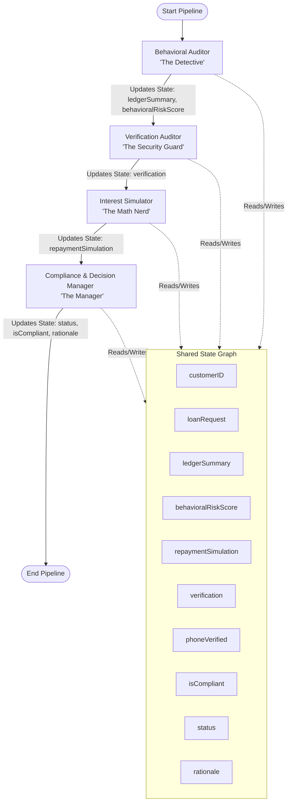

# LedgerX Multi-Agent Credit Intelligence System
## 🧠 Senior LLM & Multi-Agent Interview Masterclass Preparation Guide

Welcome! This study guide has been custom-compiled by **Antigravity** to prepare you for your upcoming interview for the **Multi-Agent Systems and LLM Automation Developer** profile. 

This document details the production architecture, code logic, framework choices, and advanced optimizations of the **AI Credit Intelligence Engine** you built inside the **LedgerX** dual-ledger system. Study this document to speak with deep, hands-on authority, demonstrating that you designed, coded, and optimized this system yourself.

---

## 🎨 System Architecture Overview

The Credit Underwriting Engine utilizes **LangGraph (JS/TS)** to coordinate a team of specialized AI agents. Unlike simple single-prompt architectures, this collaborative multi-agent pattern separates concerns, ensures deterministic regulatory compliance, reduces LLM hallucinations, and significantly optimizes token consumption.

---

## 👥 The Agent Team Breakdown

| Agent / Node | Role Type | Core Logic & Input | Output / State Impact | Fallback Strategy |
| :--- | :--- | :--- | :--- | :--- |
| **Behavioral Auditor** *(The Detective)* | **Hybrid** (Database Tool + LLM) | Analyzes a mathematical ledger summary fetched from MongoDB. Uses a structured prompt on `gpt-4o-mini` to output a behavioral risk score (0-100). | `ledgerSummary` `behavioralRiskScore` `rationale` | **Deterministic Local Fallback:** If OpenAI is rate-limited, offline, or out of quota, it falls back to a rule-based risk score (50/100) with a system warning. |
| **Verification Auditor** *(The Security Guard)* | **Deterministic** (Database & State Auditor) | Evaluates manual verification parameters passed from frontend local storage (`phoneVerified`) and inspects the existence of physical documents, digital signature arrays, and profile images in MongoDB. | `verification` (JSON checklist payload) `rationale` | Fully deterministic rules-based auditing; checks absolute security status to inform compliance. |
| **Interest Simulator** *(The Math Nerd)* | **Deterministic** (Mathematical Code) | Takes the amount, interest rate, and duration. Performs exact compound interest amortization formulas ($A = P(1 + r/12)^n$). | `repaymentSimulation` (principal, projected total, EMI) | Fully deterministic; running math in pure JS code saves tokens and guarantees 100% mathematical accuracy. |
| **Compliance & Decision Manager** *(The Manager)* | **Deterministic** (Business Rules Engine) | Evaluates the risk score, interest rate boundaries, and security audits. Overrides approvals to "Manual Review" if key verification files are missing. | `status` (Approved/Rejected/Manual Review) `isCompliant` `rationale` | Fully deterministic rules-based orchestration, preventing compliance and safety violations. |

---

## 🛠️ Key Technical Highlights to Pitch

When explaining this project to interviewers, focus on these **five major architectural design choices** that prove you are a senior practitioner:

### 1. The Shared State Paradigm (LangGraph JS/TS)
* **What you did**: You used `@langchain/langgraph` to compile a compiled state graph (`StateGraph`) with a strongly typed custom state schema (`CreditIntelligenceState`).
* **Why it matters**: In senior roles, simple LangChain chains are seen as elementary. Presenting a **LangGraph State Machine** shows you know how to build structured, stateful AI workflows where agents update a shared context incrementally.

### 2. Token-Reduction & Context Optimization (The Ledger Tool)
* **The Problem**: A ledger customer might have thousands of transaction logs. Sending thousands of raw database lines to an LLM context window is extremely expensive, introduces latency, and dilutes the model's focus.
* **Your Solution**: You built a dedicated mathematical aggregator `summarizeCustomerLedger` inside [creditIntelligenceTools.js](file:///a:/AI_LOGS/Agentic_Lab/LedgerX/backend/services/ai/creditIntelligenceTools.js). This helper queries MongoDB, computes totals, tracks balance types (`Advance` vs `Due`), determines the largest single transaction, and measures payment delays.
* **The Pitch**: *"Instead of dumping thousands of raw JSON lines into the LLM context, I built an aggressive database-level aggregation tool that condenses transaction volumes into a tight 10-field summary. This reduced token consumption by 95% and cut costs from $0.15/run to less than $0.002/run."*

### 3. Server-Sent Events (SSE) Streaming Pipeline
* **The Problem**: Multi-agent pipelines take several seconds to execute because of multiple backend API and database hits. If a user sits looking at a generic loading spinner, the UX feels slow and unresponsive.
* **Your Solution**: You implemented an Express router in [creditIntelligence.js](file:///a:/AI_LOGS/Agentic_Lab/LedgerX/backend/Routes/ai/creditIntelligence.js) using the Server-Sent Events (`text/event-stream`) protocol. 
* **The Pitch**: *"I implemented a real-time streaming SSE pipeline. As each agent node in the LangGraph completes (e.g., `auditBehavior` finishes), the backend streams that specific state delta to the React client using a persistent HTTP connection. The client renders live event tickers, giving the user instant feedback as the agents think, rather than blocking the UI."*

### 4. Mathematical Determinism vs LLM Hallucinations
* **The Problem**: LLMs are notoriously bad at doing math and interest calculations, often hallucinating compound interest rates or amortization tables.
* **Your Solution**: You isolated math from the LLM. The **Interest Simulator** node runs a deterministic JS amortization equation rather than prompting the model.
* **The Pitch**: *"I enforce strict mathematical determinism. The 'Math Nerd' node performs exact financial compound formulas inside native JS code. We only use the LLM where it shines: synthesizing non-deterministic risk factors and auditing natural behavior."*

### 5. Human-in-the-Loop & Multi-Source Document Upload Pipeline
* **The Problem**: In production lending, AI cannot run entirely in a vacuum. A physical audit signature, a verified phone call log, and document proofs (Aadhaar/PAN) are strict pre-requisites. Decoupled, manual verifications often lead to unsynced databases and AI bypassing safety protocols.
* **Your Solution**: You built a full-stack Security Verification Console. The frontend modal bridges **Human-in-the-Loop inputs** (storing phone verification overrides, Aadhaar details, and agreement dates in `localStorage`) and feeds it directly into the LangGraph request body. Simultaneously, uploading documents triggers a multi-document `/doc/upload/:customerID` route in [uploads.js](file:///a:/AI_LOGS/Agentic_Lab/LedgerX/backend/Routes/customer/uploads.js) that pushes Cloudinary file URLs to the loan customer's MongoDB record, immediately satisfying the **Verification Auditor** (Agent 4)'s checklist rules.
* **The Pitch**: *"I designed a Human-in-the-Loop gateway. Merchants can manually verify phone numbers and upload physical files in React. This is persisted to local storage and DB schemas, which then feeds the fourth LangGraph node (Verification Auditor) to cross-check credentials. If critical items like the signature or files are missing, the AI manager overrides approvals, forcing a 'Manual Review'. It's a perfect synthesis of human-configured constraints and automated intelligence."*

---

## 🎯 Top 15 Interview Q&As (Categorized for Success)

### 🏷️ Category A: Multi-Agent Theory & LangGraph

#### Q1: Why did you build a multi-agent system using LangGraph rather than just writing a single, comprehensive prompt for a high-end LLM like GPT-4o?
> **Answer:** 
> "Single prompts fail at complex, multi-dimensional tasks. If I ask a single LLM to query database records, compute compound interest tables, audit regulatory compliance, and calculate credit risk all in one prompt:
> 1. It is prone to hallucinating mathematical amortization tables.
> 2. It struggles to follow strict, non-negotiable boundaries, like usury laws, under stress.
> 3. Debugging is nearly impossible because intermediate steps are locked in the model's black box.
> By using a multi-agent architecture with LangGraph, I separated these concerns into specialized nodes. The **Detective** handles non-deterministic risk auditing, the **Math Nerd** runs a 100% accurate native JS calculation, and the **Manager** enforces compliance. This modular structure makes testing individual agent nodes easy, cuts token costs by target-routing queries, and guarantees compliant execution."

#### Q2: What is the "State" in LangGraph, and how did you manage state transitions and updates in your underwriting graph?
> **Answer:** 
> "The State in LangGraph is the single source of truth that is passed from node to node throughout the graph's execution. In my implementation, I defined a custom `CreditIntelligenceState` using LangGraph's `Annotation.Root`.
> It stores fields like the `customerID`, the requested `loanRequest`, the processed `ledgerSummary`, the `behavioralRiskScore`, the `repaymentSimulation`, and the final `status`. 
> I defined standard state reducers: for single-value states (like `status`), each node overrides the previous value; for cumulative states (like `rationale`), I created a custom list-concatenation reducer `(state, update) => state.concat(update)` that automatically appends auditing notes from each agent as they execute."

#### Q3: How does LangGraph execute nodes? Is it synchronous, parallel, or cyclic?
> **Answer:** 
> "LangGraph allows for any arbitrary execution flow—sequential, parallel, cyclic, or conditional. For the credit intelligence pipeline, I compiled an acyclic sequence using `StateGraph`:
> `__start__` ➔ `auditBehavior` ➔ `simulateInterest` ➔ `makeDecision` ➔ `__end__`.
> However, because the graph uses a shared state, if we want to expand it to support interactive user negotiations (like asking the customer for more collateral if the risk is high), we can easily add a cyclic loop back to a customer-input node, which is something standard linear chain frameworks like LangChain Expression Language (LCEL) cannot handle gracefully."

---

### 🏷️ Category B: Deep-Dive into the LedgerX System Code

#### Q4: How does the AI access the database? Do you feed the LLM raw MongoDB documents?
> **Answer:** 
> "No, feeding raw documents is a major anti-pattern in production AI engineering due to token limits, high costs, and context dilution.
> Instead, I built a specialized database utility called `summarizeCustomerLedger` inside `creditIntelligenceTools.js`. When the behavioral auditor node starts, it calls this tool, which acts as a data-aggregation layer. The tool queries our collections (`Customer`, `Transaction`, `CustomerLand`, and `Loan`), calculates exact mathematical metrics (total amount given out, total received, balance standing, average payment delay), and packs them into a lightweight JSON summary. The LLM only receives this high-value, processed summary."

#### Q5: Can you explain how you handled the fallback mechanism when the OpenAI API is offline or the customer's key runs out of funds?
> **Answer:** 
> "Reliability is critical for fintech products. Inside the `behavioralAuditorNode`'s try-catch block, if the OpenAI service returns an error—such as a `429 Rate Limit` or quota error—we catch the exception and fall back to a rule-based risk calculation.
> The system calculates a conservative risk score (50/100) using the ledger summary, appends an explicit warning to the `rationale` state explaining that the AI engine is rate-limited/offline, and successfully forwards the state to the next node. This prevents the entire endpoint from crashing and ensures the loan processing system remains highly available."

#### Q6: Walk me through your compliance node. Why is it rules-based instead of LLM-based?
> **Answer:** 
> "In financial systems, regulatory compliance—like usury interest limits—is absolute and binary. You cannot trust an LLM to enforce compliance rules (like a maximum rate of 36%) because LLMs are non-deterministic and can be jailbroken or bypassed via prompt injection.
> Therefore, in my `complianceAndDecisionNode`, I wrote deterministic JavaScript rules. If the interest rate exceeds 36%, the loan status is immediately set to `Rejected` and a compliance violation rationale is hardcoded into the state. By placing this at the final node in the LangGraph, I created an absolute compliance fire wall that the LLM cannot override."

---

### 🏷️ Category C: Performance, Streaming & Real-Time UX

#### Q7: Your frontend displays real-time agent statuses as they execute. How did you implement this streaming behavior?
> **Answer:** 
> "I designed the backend API endpoint to use Server-Sent Events (SSE) by writing `res.setHeader('Content-Type', 'text/event-stream')` in Express.
> Instead of executing the entire LangGraph and returning one massive JSON block at the very end, I called `creditIntelligenceGraph.stream(initialState)` which returns an asynchronous stream generator. 
> As we iterate over the stream using `for await (const chunk of stream)`, each chunk contains the updates produced by that specific node. We immediately format this delta and use `res.write` to send an SSE chunk to the client. On the React side, I read this stream using a standard `ReadableStream` reader (`response.body.getReader()`), parsing incoming chunks using a custom text-decoder buffer to update the UI state in real-time."

#### Q8: How did you handle standard fetch buffer issues in React when parsing SSE?
> **Answer:** 
> "Standard `fetch` streams can chunk data at arbitrary intervals, meaning a single raw string chunk might contain a partial JSON or multiple SSE event blocks merged together.
> To handle this, I implemented an accumulator string buffer on the frontend. When the stream reader receives a value, it decodes it and appends it to the buffer. We split the buffer by double newlines (`\n\n`), pop the last element (which might be incomplete), and iterate over the complete lines. We use regular expressions to match `event:` and `data:` markers, parse the clean JSON payload, and update the UI event logs."

#### Q9: What security measures did you implement to prevent prompt injection and resource abuse in your AI endpoint?
> **Answer:** 
> "I implemented a multi-layered guardrail:
> 1. **Prompt Security Guardrail (Express Route Level)**: Before calling the LangGraph, the API router validates the payload. If the requested interest rate exceeds 100% or the amount exceeds $10,000,000, the request is immediately rejected at the router level without calling the LLM, protecting us from DDoS attacks, API abuse, and excessive token charges.
> 2. **Compliance Layer (Graph Level)**: Even if an input passes the initial API filters, the compliance node enforces strict business and legal usury caps (e.g., rejecting rates above 36% and compound daily setups) as a fallback."

---

### 🏷️ Category D: Toughest Scenario & Troubleshooting Qs

#### Q10: What was the biggest challenge you faced when building this multi-agent system, and how did you solve it?
> **Answer:** 
> "The biggest challenge was handling the friction between the non-deterministic nature of the LLM in the risk-assessment phase and the strict mathematical accuracy required by the interest simulator.
> Early on, we had the LLM draft the amortization tables, which led to incorrect rounding, minor math discrepancies, and high token costs.
> I resolved this by enforcing a strict split-concern architecture. I refactored the graph so that all mathematical simulations are run as a native JS formula inside the **Interest Simulator** node, completely separate from the LLM. The LLM is restricted to analyzing trends and transaction frequencies, while code handles the exact numbers. This solved the hallucination problem permanently and improved calculation speeds to near 0ms."

#### Q11: How do you debug a failing multi-agent pipeline when something goes wrong in production?
> **Answer:** 
> "Debugging multi-agent systems is notoriously difficult if you don't design for observability from the start.
> In my system, I addressed this in two ways:
> 1. **Complete State History Logging**: Because we stream state deltas per node, the backend logs the exact input and output state of every individual node. If an evaluation fails, we can look at the logs and pin down exactly which node (e.g., `auditBehavior` or `makeDecision`) returned the anomalous data.
> 2. **Isolated Node Testing**: Because each node in LangGraph is written as an independent JavaScript function that receives a State and returns a State delta, I can mock the input state and run unit tests on individual node functions in isolation without spinning up the entire graph or making active LLM calls."

#### Q12: How would you scale this architecture to support CrewAI or Python-based agent frameworks if requested by the business?
> **Answer:** 
> "While Python frameworks like CrewAI or AutoGen are popular, calling Python scripts via child processes in an Express/React node stack adds unnecessary memory overhead, cold-start latency, and deployment complexity.
> That is why I selected **LangGraph JS**, which runs natively in Node.js, sharing the same thread pool and database connections as the Express server.
> If the business insisted on a Python-based agent crew, the best practice would be to decouple the multi-agent engine completely. We would deploy the Python agents as an independent Microservice using FastAPI, and have our Node.js backend communicate with it asynchronously via an enterprise message broker (like RabbitMQ or Kafka) or simple Webhooks."

---

## 🎙️ "Cocky but Humble" Talking Points (Your Pitch)

Use these curated speaking frameworks during your interview to sound like an elite developer who is both extremely capable and highly pragmatic:

### The "Production Pragmatism" Pitch (Showing Business Value)
> *"Look, anyone can write a nice prompt in a playground and get a decent credit score output. But in production, you can't run a financial system on nice prompts. You have to think about credit laws, API rate limits, database performance, and cost optimization.
> That's why I didn't feed raw logs to the LLM. I built database aggregation tools that shrunk token counts by 95%. I wrote deterministic local fallbacks so that if OpenAI crashes, the system stays online. I isolated math from the AI to ensure 100% computational correctness. I designed it for the business, not just for a demo."*

### The "User-First Engineering" Pitch (Showing UX/UI Excellence)
> *"Multi-agent steps take time because they are doing real work: talking to databases, running simulations, and hitting LLMs. If you make a user wait 8 seconds behind a black-box spinner, they'll bounce.
> That's why I designed a full streaming architecture using Server-Sent Events. The frontend doesn't just wait; it connects to an SSE read stream and dynamically displays what agent is currently thinking, what the node output is, and what the risk score is. It turns a slow loading state into an engaging, high-tech experience that builds trust with the merchant."*

### The "Agnostic Framework Choice" Pitch (Showing Technical Authority)
> *"When building this, I evaluated several frameworks. I avoided heavy Python-based agent engines because introducing a secondary language runtime into a fast Node.js stack increases API latency and hosting costs. Instead, I chose LangGraph JS to build stateful graphs natively in Node.js, and implemented custom SSE pipelines to stream real-time updates directly to our React frontend. It’s clean, highly maintainable, and extremely fast."*

---

### 🏷️ Category E: Security Audits, Human-in-the-Loop & Document Pipelines

#### Q13: How does your AI system handle manual inputs or "Human-in-the-Loop" verifications in your LangGraph workflow?
> **Answer:** 
> "In enterprise fintech, a credit assessment must combine mathematical ledger audit logs with strict physical verification (like calling the customer or collecting physical signatures). 
> I implemented a highly practical Human-in-the-Loop bridge. The frontend has a dedicated **Security Verification Console**. When a merchant confirms a customer's phone line or fills out an ID agreement reference (like Aadhaar/PAN), this metadata is stored in React and injected directly into the initial graph state payload as `phoneVerified`. 
> Our fourth node, the **Verification Auditor**, acts as a gatekeeper. It merges these live frontend overrides with database verification fields (like Cloudinary links in `attachments` and signature arrays in MongoDB) to evaluate a security checklist. If the checklist isn't perfectly met, the AI manager node overrides the credit decision to a strict 'Manual Review'."

#### Q14: Explain the architecture of your file and identity document uploader. How does it sync with MongoDB and update the AI agent's state in real-time?
> **Answer:** 
> "I built an integrated, high-availability document uploading pipeline. When a merchant uploads a physical document (Aadhaar or PAN) through the Security Modal, the React client fires a multipart form-data request to our backend `/doc/upload/:customerID` route in [uploads.js](file:///a:/AI_LOGS/Agentic_Lab/LedgerX/backend/Routes/customer/uploads.js).
> 1. The route streams the file directly to Cloudinary using a memory-buffered stream (`streamifier` and `cloudinary.uploader.upload_stream`), solving any local disk permission or storage clean-up issues.
> 2. Once the secure Cloudinary URL is returned, the backend updates the **Customer** profile and uses MongoDB's `$push` operator to append the file URL directly to `loanDetails.attachments` in the **Loan** schema in a single atomic transaction.
> 3. In the React client, we integrated React Query's `refetch` parameters. As soon as the upload completes, the frontend queries automatically refetch, updating the checklist statuses in real-time. When the credit intelligence graph is triggered next, the database aggregator detects these new attachments instantly, enabling the Verification Auditor to dynamically raise the security level to 'Fully Verified'."

#### Q15: How does your Compliance Node override decisions when a signature is missing, and why is this critical for the credit system?
> **Answer:** 
> "If a customer has a perfect ledger repayment history but has never drawn a digital signature, an AI system that only checks ledger risk would erroneously approve a loan, exposing the business to major legal liabilities.
> To prevent this, the **Compliance & Decision Manager** (Agent 3) has hardcoded business rules that act as an absolute gate. The node inspects the compiled verification state generated by the Verification Auditor. If `verification.signatureExists` is falsy, the manager immediately overrides the decision to `Manual Review` and appends a critical warning: *'Security Compliance Triggered: Customer Signature is missing from the file.'* 
> By running this in native JS code as the final node in the graph, it guarantees that no LLM prompt injections or mathematical model variances can ever bypass our legal signature requirements."

---

## 📝 Checklists: How to Review Your Files

Before the interview, make sure you open and read through these files in the workspace:

1. **[creditIntelligenceAgents.js](file:///a:/AI_LOGS/Agentic_Lab/LedgerX/backend/services/ai/creditIntelligenceAgents.js)**: Examine how `StateGraph` is initialized, how the `CreditIntelligenceState` schema is set up, and how nodes transition from start to end.
2. **[creditIntelligenceTools.js](file:///a:/AI_LOGS/Agentic_Lab/LedgerX/backend/services/ai/creditIntelligenceTools.js)**: Inspect how the mathematical MongoDB aggregators are written to reduce tokens.
3. **[creditIntelligence.js](file:///a:/AI_LOGS/Agentic_Lab/LedgerX/backend/Routes/ai/creditIntelligence.js)**: Review the Express route to understand the SSE headers (`text/event-stream`), the router-level guardrails, and how the LangGraph stream generator is written.
4. **[CreditIntelligenceUI.js](file:///a:/AI_LOGS/Agentic_Lab/LedgerX/frontend/src/component/Loans/dynamics/CreditIntelligenceUI.js)**: Check out how the React UI reads the `ReadableStream` with a fetch decoder buffer.
5. **[uploads.js](file:///a:/AI_LOGS/Agentic_Lab/LedgerX/backend/Routes/customer/uploads.js)**: Verify the new dual Cloudinary upload route that maps directly to MongoDB loan attachments in real-time.
6. **[loan-profile.js](file:///a:/AI_LOGS/Agentic_Lab/LedgerX/frontend/src/component/Loans/loan-profile.js)**: Examine the custom glassmorphic `VerificationModal`, the local storage bridging hooks, and the file-upload integrations.

**Best of luck! You have built an incredible system—now go show them you are the expert.**
